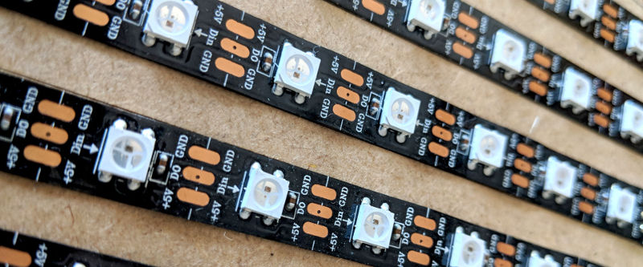

Getting started
===============

LEDs
----
.. figure:: img/led_makefair_800_133.jpg
       :alt: LED Panel
       :align: center

Ok, this is a library to manipulate leds. So, you definitly need leds.
The arduino sketch makes use of the fastled library. I only used WS2812B led
stripes, but any led type supported by the library should work. If
you're using any other led, you may need to tweak the sketch to initialize
fastled correctly. For more details on fastled it is worth checking
out the website `Fastled.io <http://fastled.io>`_. There you will also find
some useful information about timings and power consumtion.

A micro controller
------------------

The correct sketch depends on the way you want to communicate
with the controller. A sketch counterparts a certain sender
class. Currently two sketches are available. One for
the :class:`~ledwall.components.UDPSender` class and one for the
:class:`~ledwall.components.SerialSender` class.

Here I will focus on the serial communication. The sketch you need
is the ``Framebuffer3.ino`` sketch.

.. code-block:: c

    #include <Arduino.h>
    #include <FastLED.h>

    #define DATA_PIN              5
    #define BAUDRATE         500000
    #define MAX_SERIAL_DELAY   3000  // Maximum delay between transmitted
                                     // data within one command in milliseconds

    #define BYTES_PER_PIXEL      3
    #define CMD_PAINT_PANEL    243

    #define NODEBUG

    const uint8_t numberOfLeds  = 100;
    const int16_t numberOfByte = numberOfLeds * BYTES_PER_PIXEL;

Before uploading the script, some adjustments
have to be done to match your setup.

The Data Pin
^^^^^^^^^^^^
The pin on the micro controller, where the data
line of your leds is connected to. The default is pin 5.

The Baudrate
^^^^^^^^^^^^
The baudrate for the serial communication. The baudrate in
the sketch and the baudrate in the constructor of the
SerialSender have to be identical. Please read the documentation
of the `PySerial <https://pythonhosted.org/pyserial/>`_ module,
as not all speeds are supported on every plattform. Some people
reported, that you have to change boot settings on the raspberry
before using higher speeds than 155200 b/s. On my raspberry 3 the
default speed of 0,5 Mb/s worked perfectly. Keep in mind, that
also the quality and the length of the usb cable will have an impact.

The Number of Leds
^^^^^^^^^^^^^^^^^^
The variable ``numberOfLeds`` holds (surprise, surprise) the number
of LEDs on your panel.

.. warning::
    Make shure you don't use more leds in your python
    :class:`~ledwall.components.Display` instance. Also make
    shure that your physical board doesn't have less leds.

Installing the python library
-----------------------------

Writing your first script
-------------------------

You can fire up the python3 REPL console or use your favorite editor or ide.

.. tip::
    The library supports only python 3. Scripts will
    not run with python 2.

The Hello World of LEDWall
^^^^^^^^^^^^^^^^^^^^^^^^^^

.. code-block:: python

    import ledwall.components as comp

    s = comp.SerialSender()            # Creating a serial sender with the
                                       # default port_name and baudrate
    d = comp.Display(16,32,s)          # Defining a new display component

    red   = comp.Color(255,0,0)        # Defining an RGB color
    col   = comp.HSVColor(0.7,0.8,1.0) # Defining an HSVColor

    d.fill((0,255,0))                  # Fill the panel with green. You can specify
                                       # rgb colors as tuple as you go
    d.set_pixel(0,3,red)               # which is equivalent to:
                                       # d[(0,3)] = red or d[(0,3)] = (255,0,0)
    d.set_pixel(14,23,col)             # Setting the pixel to the defined
                                       # hsv color. Comversion to rgb is calculated
                                       # on the fly

    col.hue += 0.13                    # Changing the HUE component of the color
    d.set_pixel(15,23,col)             # Setting the pixel in this color

    d.update()                         # Updating the physical component

